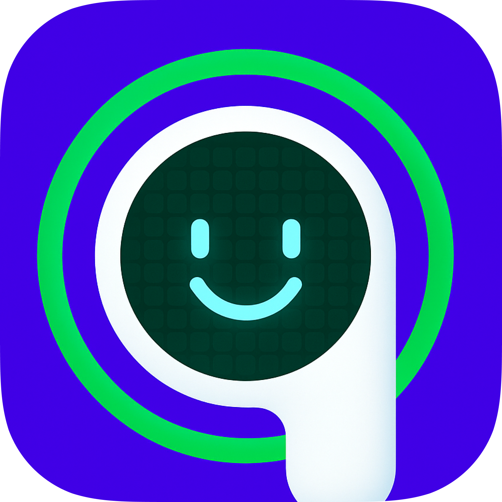

# AirPosture

  

<h1 align="center">AirPosture</h1>

    Turn your AirPods into a posture coach on macOS & iOS. AirPosture uses your AirPods' sensors to catch bad posture in real time.
     
    <a href="https://www.airposture.pro/">Website</a>
    ·
    <a href="mailto:allen@airposture.pro">Report Bug or Request Feature</a>
  

  

  

   
  - 🚧 <strong>Status:</strong> alpha stage
   
  - 🧭 <strong>Follow updates on <a href="https://x.com/allenleev0" target="_blank">X</a></strong>

## Demo

    

    

## Acknowledgments

- Built using [headtracker](https://github.com/ctxzz/HeadTrackerApp)
